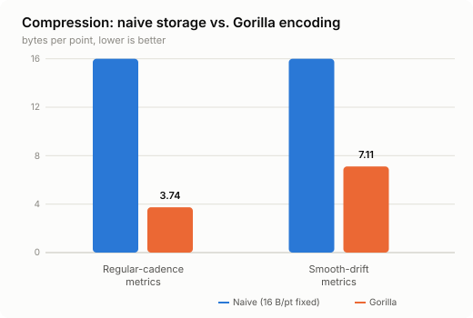
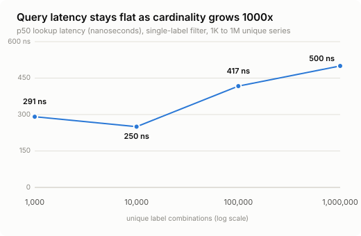
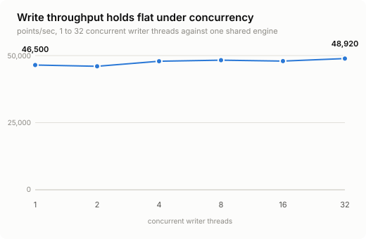

# Strata

[](https://github.com/kankaniakshat185/strata/actions/workflows/ci.yml)

**A tiered-resolution time-series database, built from scratch in C++.**

Strata ingests high-frequency metrics (server CPU, IoT sensors, request
latencies — anything timestamped), compresses them in real time, and
automatically ages old data down into smaller statistical summaries
instead of either deleting it or storing everything at full resolution
forever. It's the same core problem behind Prometheus, InfluxDB, and
M3DB, built end to end: write-ahead logging, a custom bit-level
compression codec, LSM-style compaction, an inverted index for
high-cardinality label queries, and a query planner that reads only the
data a request actually needs.

No frameworks, no third-party libraries — just the C++ standard library
and POSIX file I/O. ~2,400 lines of engine code, ~900 lines of tests,
9 test binaries, all passing, plus two crash-recovery test harnesses
(one of which literally sends the process `SIGKILL` mid-write and
confirms it comes back with no data loss).

**[Read how it works →](docs/HOW_IT_WORKS.md)** — the pipeline walked
through stage by stage, the compression codec's math with real worked
examples, and the engineering principles behind the crash-safety and
query-routing design.

## Why this project

Most from-scratch database projects stop at "it stores data and you can
read it back." Strata's angle: production time-series systems have to
solve three problems that are usually treated as separate bolted-on
features —

1. **Ingest volume** is high and continuous, so writes have to be cheap.
2. **Label cardinality** (host, region, service, ...) can reach millions
   of unique combinations, and a naive index buckles under that.
3. **Old data isn't worth keeping at full resolution**, but throwing it
   away loses trend analysis.

Strata treats compaction as the actual transform step of a pipeline —
raw points land fast and unprocessed, and the real statistical work
(computing min/max/avg/p99 rollups) happens later, off the write path —
rather than bolting compression, compaction, and indexing on as three
disconnected pieces.

## Architecture

```
Writers ──> WAL (fsync'd) ──> MemTable ──> flush ──> L0 (Gorilla-compressed, raw resolution)
                                                            │
                                                  background compaction
                                                            ▼
                                            L1 (downsampled rollups: min/max/avg/count/p99)

              Inverted index: label filter ──> matching series, in O(1)-ish time
                                        regardless of how many series exist

  Query router: recent range ──> L0 · older range ──> L1 · spanning range ──> both, stitched
```

## Highlights

- **4.3x smaller than naive storage** — a hand-implemented version of
  Facebook's Gorilla compression algorithm (delta-of-delta timestamps +
  XOR'd floating-point values, encoded and decoded bit by bit)
- **Query latency stays flat from 1,000 to 1,000,000 unique label
  combinations** (sub-microsecond lookups even at 1M) — solved with an
  inverted index instead of a naive scan, the same cardinality wall real
  monitoring systems have to engineer around
- **~1,000x storage reduction** on aged data via statistical downsampling,
  with the accuracy tradeoff actually measured (not assumed): a
  divergence table showing exactly how much a rolled-up p99 drifts from
  the true value at different summarization granularities
- **Crash safety proven, not assumed** — deterministic fault injection
  (the same technique used in RocksDB and TiKV) kills the process at 5
  exact code points mid-write and mid-compaction, and every scenario
  recovers with zero data loss beyond what was already in flight
- **Query planner that skips work it doesn't need** — a 10-minute query
  against months of history touches only the 1-2 blocks that actually
  overlap it, verified with real scanned/skipped block counts

## Skills demonstrated

Systems programming in modern C++ (manual bit-packing, POSIX file I/O,
mutex-based concurrency) · implementing a published algorithm from a
paper rather than a library · designing and locking an on-disk binary
format · crash-safety design (write-ahead logging, atomic file swaps,
fault injection testing) · benchmarking methodology and honest reporting
of tradeoffs, not just headline numbers.

## Quick start

```bash
make test                                  # build everything, run all unit tests
./build/strata_tool write ./data 100000    # write a burst of points
./build/strata_tool recover ./data         # replay + report what's there
./build/strata_tool compact ./data         # downsample old data
./build/strata_tool bench ./data           # compression ratio
./build/strata_tool cardbench              # cardinality-scaling benchmark
./build/strata_tool query-bench ./data     # query-latency-by-range benchmark
./build/strata_tool loadtest ./data        # concurrent-writer throughput
```

No external dependencies — builds with `clang++ -std=c++20` via a plain
Makefile.

## Results

*Measured on the dev machine; the shapes of these results (compression
ratio, flat query latency, throughput plateau) are the real findings —
exact numbers will vary by hardware.*

**Compression** — bytes per point, raw vs. compressed:



| | Naive (uncompressed) | Strata (Gorilla) |
|---|---|---|
| Regular-cadence metrics | 16.0 B/pt | 3.74 B/pt (4.3x smaller) |
| Smooth-drift metrics | 16.0 B/pt | 7.11 B/pt (2.25x smaller) |

**Cardinality scaling** — the headline result:



| Unique label combos | Index size | Lookup latency (p50 / p99) |
|---|---|---|
| 1,000 | 147 KB | 291 ns / 791 ns |
| 10,000 | 1.5 MB | 250 ns / 792 ns |
| 100,000 | 15.2 MB | 417 ns / 916 ns |
| 1,000,000 | 147 MB | 500 ns / 1.3 µs |

Index size grows linearly, as expected — latency barely moves.

**Query planning** — 100 days of data, most of it aged into summaries:

| Range requested | Blocks touched | Blocks correctly skipped |
|---|---|---|
| 10 minutes | 1 | 99 |
| 3 days (spans both resolutions) | 3 | 97 |
| 90 days | 90 | 10 |

**Crash recovery** — process killed at 6 different exact points during
writes and compaction: every scenario recovers with no corruption and no
data loss beyond what hadn't been durably written yet.

**Concurrency** — throughput holds flat (~46K–49K points/sec) from 1 to
32 concurrent writer threads, because every write is durably fsync'd to
disk before it's acknowledged — the honest ceiling of a durability-first
design, not a bottleneck that was missed.



## Engineering tradeoffs

Built to be defensible, not to look feature-complete. What's explicitly
out of scope, and why:

- **One compaction level (L0 → L1), not a full multi-level LSM tree.**
  The mechanism generalizes cleanly; a second level wasn't worth the time
  against a project that already proves the technique.
- **Rollup percentiles are a point estimate, not a full quantile
  sketch.** Accurate enough as a trend signal for old data; a system that
  needed precise historical percentiles would store a proper sketch
  (t-digest, HDR histogram) per summary bucket instead — a real design
  change, called out rather than glossed over.
- **Write throughput is capped by fsync-per-write, by choice.** Every
  write is durable the instant it's acknowledged. The standard next step
  for higher throughput — batching multiple writers' records into one
  fsync ("group commit") — is a well-scoped future improvement, not
  implemented here.

## License

Personal project, built for learning and portfolio purposes.
