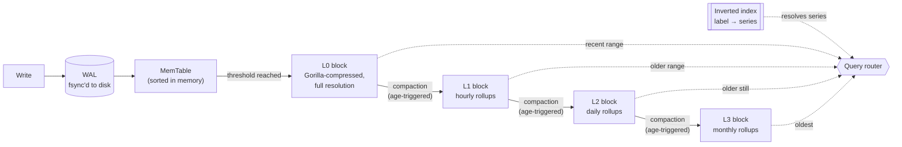

# How Strata works

This walks through the actual pipeline data takes through Strata, the
math behind the compression codec, and the engineering principles the
whole system is built around. If the [README](../README.md) is the
pitch, this is the explanation.

## The pipeline

Strata treats compaction as the *transform* step of an ELT (Extract,
Load, Transform) pipeline, not a separate housekeeping feature bolted on
after the fact. Data lands **fast and untouched** first; the expensive
statistical work happens later, off the write path:



Four stages, each doing one job:

1. **Write-ahead log (WAL).** Every point is appended to a log file and
   `fsync`'d before the write is considered durable. If the process dies
   the instant after, the point survives — it just hasn't been organized
   yet.
2. **MemTable.** An in-memory sorted buffer. Fast to insert into, cheap
   to scan in timestamp order once it's time to flush.
3. **L0 blocks.** When the MemTable crosses a size threshold, it's
   written out as an immutable, compressed block — the "Load" step:
   points land close to their raw form, just compressed, not
   reinterpreted.
4. **L1 blocks.** A background pass scans aged L0 blocks, groups their
   points into fixed time windows, and replaces each window with a
   single statistical summary (count, min, max, avg, p99). This is the
   actual "Transform" — turning thousands of points into one row — and
   it's the step most from-scratch time-series projects treat as an
   afterthought rather than the core mechanism.

A **query** doesn't care which stage data is in: the router resolves the
requested labels through the inverted index first, then reads L0 for
recent ranges, L1 for old ones, or both if the range spans the boundary.

## The compression codec, with real numbers

Storing every point as a raw 16-byte `(timestamp, value)` pair is
correct but wasteful — most real metrics don't change much point to
point. Strata implements **Gorilla encoding** (the algorithm behind
Facebook's in-memory time-series database) at the bit level: two
independent tricks, one for timestamps and one for values, both
exploiting the same idea — *encode the difference from the last point,
and spend almost no bits when that difference is small or repeats.*

### Timestamps: delta-of-delta

Metrics usually arrive on a regular cadence — every second, every five
minutes. So instead of storing each timestamp, or even the gap between
consecutive timestamps, Strata stores **how much the gap changed** from
the previous gap. For perfectly regular data, that's zero, over and
over.

Concretely, for timestamps `t₀, t₁, t₂, ...`:

```
delta_i = t_i - t_{i-1}
DoD_i   = delta_i - delta_{i-1}
```

`DoD` (delta-of-delta) gets encoded with a variable-length code — the
smaller it is, the fewer bits it costs:

| DoD range | Encoding | Total cost |
|---|---|---|
| exactly 0 | `0` | **1 bit** |
| −63 to 64 | `10` + 7-bit value | 9 bits |
| −255 to 256 | `110` + 9-bit value | 12 bits |
| −2047 to 2048 | `1110` + 12-bit value | 16 bits |
| anything larger | `1111` + 32-bit value | 36 bits |

Worked example — five points arriving roughly every 1000ms, with one
5ms hiccup at the end:

| i | timestamp | delta | DoD | encoding | cost |
|---|---|---|---|---|---|
| 0 | 1000 | — | — | raw 64-bit | 64 bits |
| 1 | 2000 | 1000 | 1000 | `1110` + 12-bit(1000) | 16 bits |
| 2 | 3000 | 1000 | 0 | `0` | **1 bit** |
| 3 | 4000 | 1000 | 0 | `0` | **1 bit** |
| 4 | 5005 | 1005 | 5 | `10` + 7-bit(5) | 9 bits |

After the unavoidable first point, four more timestamps cost 16 + 1 + 1
+ 9 = **27 bits total** — versus 256 bits (32 bytes) if each were stored
raw. Regular cadence is the common case in real metrics, and it's
exactly the case this encoding was built for.

### Values: XOR against the previous point

Floating-point values that are close together share most of their bit
pattern — sign, exponent, and often the top mantissa bits are identical.
XOR-ing a value against the previous one zeroes out everything they
share, leaving only the bits that actually changed:

| Value | Bit pattern (hex) | XOR vs. previous |
|---|---|---|
| 65.0 | `0x4050400000000000` | — (first point, stored raw) |
| 65.0 | `0x4050400000000000` | `0x0000000000000000` — identical, **1 bit** to encode |
| 65.125 | `0x4050480000000000` | 1 bit differs, surrounded by 20 leading + 43 trailing zeros |
| 65.125 | `0x4050480000000000` | identical again — **1 bit** |
| 70.5 | `0x4051a00000000000` | 6 bits differ (bigger jump, new value entirely) |

These are the actual IEEE-754 bit patterns, not illustrative
approximations. The encoding writes:

- `0` if the XOR is zero (value repeated exactly) — **1 bit**, done.
- Otherwise `1`, then either:
  - `0` + just the changed bits, if this XOR's nonzero region lines up
    with the *previous* nonzero XOR's region (common for a value
    drifting steadily in the same part of its mantissa), or
  - `1` + 5 bits (leading-zero count) + 6 bits (how many bits changed) +
    the changed bits themselves, if the region moved.

In the table above: `65.0 → 65.0` costs 1 bit, `65.125 → 65.125` costs 1
bit, and only the two points where the value actually jumped
(`65.0 → 65.125`, `65.125 → 70.5`) pay the full cost of describing which
bits changed.

### Why not just gzip everything?

It's a fair question, and the honest answer is: on some data shapes,
gzip actually compresses tighter than this hand-built codec (see the
[README](../README.md#results) for the real numbers). The reason Strata
still implements Gorilla rather than shelling out to gzip is that they
solve different problems. Gzip is a **batch** compressor — it needs the
whole block in hand to find repeated patterns anywhere in it. Gorilla is
a **streaming** compressor — it encodes each point the instant it
arrives, using only the one point before it, with no buffering and no
second pass. That property is what lets Strata compress *as data is
ingested* rather than as a separate step after the fact — the tradeoff
is intentional, not a missed opportunity.

## Compaction: turning points into statistics

A pass scans L0 blocks old enough to be eligible, and for each series,
groups their points into fixed-width time buckets (e.g. one bucket per
hour). Every bucket becomes one row in the output:

```
count, min, max, avg, p99
```

500,000 raw points can collapse into a few dozen buckets this way — a
~1,000x reduction in the demo dataset in the README, though real,
less-repetitive traffic won't compress anywhere near that hard. The
important part isn't the ratio, it's that a query for "average CPU last
month" doesn't need to read a month of raw points to answer — the answer
is already sitting in the rollup.

**The cascade doesn't stop at one level.** The same mechanism runs again
on L1's output: L1's hourly buckets age into L2's daily buckets, and L2's
daily buckets age into L3's monthly ones. Each hop is the same
operation — merge several summaries into one coarser summary — just
applied one level up. Directories `L0/` through `L3/` and a MANIFEST
entry per level track which blocks are live at each resolution; a query
spanning a wide enough range can end up stitching together data from
several levels at once, each kept at its own resolution rather than
blended into one.

**The honest tradeoff, and where it actually shows up.** A rollup's p99
is computed once, over its own bucket, and then the raw points are
thrown away — there's no way to recompute an exact combined p99 later.
Two different places this matters:

- **At query time**, a request spanning several buckets has to
  approximate a combined p99 by averaging the buckets' individual p99s.
- **At compaction time**, merging L1 buckets into an L2 bucket (or L2
  into L3) uses that same count-weighted average of the source p99s —
  it's the only information left to work with once the raw points are
  gone.

Both get measurably worse as the buckets being combined get smaller,
because a small bucket's own p99 is nearly always close to its own
max — averaging many small buckets' near-maxima drags the result toward
the plain mean, not the true 99th percentile. This isn't a rounding
error; it's a structural property of averaging percentiles at all. A
test built specifically to demonstrate the compaction-time version of
this (20 narrow L1 buckets, 2 of them containing a real spike, merged
into one L2 bucket) measured an **89% divergence** between the merged
estimate and the true p99 computed directly from the same underlying
points. Known, measured, not hidden — a production system that needed
accurate historical percentiles would store a proper streaming quantile
sketch per bucket instead of a single number.

**Making the swap crash-safe.** Compaction writes a brand new, coarser
block and then needs to retire the finer blocks it summarized — two
separate file operations that can't happen atomically on their own. A
crash between them could leave the system trusting neither. The fix is a
small manifest file listing which blocks are currently "live" at every
level: write the new block, `fsync` it, write the new manifest to a temp
file, `fsync` that, then rename it over the old manifest in one atomic
filesystem operation. Only after that succeeds are the superseded blocks
deleted. A crash at any point before the rename leaves the *old*
manifest in place — still pointing at the still-valid old data — and
compaction simply retries on the next run, at whichever level it was
working on.

## Finding series fast: the inverted index

A metric is identified by its labels — `host=web-3, region=us-east,
metric=cpu_usage` — and production systems can have millions of unique
label combinations. Scanning every series to find the ones matching a
filter doesn't scale.

Strata builds a hash map from **each individual label pair** to the list
of series carrying it:

```
host=web-3      → [series 42]
region=us-east   → [series 7, 42, 108, 391, ...]
metric=cpu_usage → [series 3, 42, 55, 108, ...]
```

A query with several filters intersects the matching lists — and does it
smartly, starting from the *smallest* list first. Filtering `host=web-3`
(one series) against `region=us-east` (possibly hundreds of thousands)
by starting with the one-entry list means the expensive list barely gets
touched. That ordering is the entire reason lookup latency stays flat
even at a million unique series (see the chart in the README) — without
it, a filter that included a common label would degrade linearly with
total series count no matter how small the *other* filter was.

## A second index, built specifically to compare against the first

A hash map has no idea what order its keys are in — that's exactly why
looking one up is so fast, and exactly why it can't answer "give me
every series where the label starts with `host=h1`" without checking
every single key. A **B+ tree** keeps every key sorted instead, organized
as a tree of nodes with the bottom layer — the leaves — chained together
in order. That sorted chain is the one thing this structure can do that
the hash map structurally cannot: walk a *range* of keys without
touching anything outside it.

```
                    [ host=h5 | host=h9 ]
                   /          |          \
       [host=h1..h4]   [host=h5..h8]   [host=h9..]
        (leaf)  ──────→  (leaf) ──────→  (leaf)
```

This isn't a replacement for the hash map — it's a deliberate second
implementation, built to answer the same question two structurally
different ways and see what each is actually good at, rather than
assuming. The honest expectation going in: a plain lookup should favor
the hash map, easily. It does. Real numbers, same synthetic dataset the
cardinality benchmark uses, at 1,000,000 unique label combinations:

| | Hash map | B+ tree (order 128) |
|---|---|---|
| Single lookup (p50) | **500 ns** | 3,833 ns |
| 3-filter intersect (p50) | **4,542 ns** | 9,417 ns |
| Prefix scan (`host=h1*`, 111K matches) | 77.2 ms | **22.7 ms** |

The prefix scan is the real comparison — the operation the hash map has
no shortcut for at all (its version just checks all one million keys and
keeps the ones that match; see `InvertedIndex::PrefixQuery`). The tree
wins there, and the gap *widens* with scale: about 2.1x faster at 1,000
entries, 3.4x faster at 1,000,000. That's the actual point of building a
second structure — not to win at everything, but to find the one place
it structurally can.

**Node width is a real design knob, so it got measured instead of
guessed.** How many keys fit in one tree node before it splits changes
the tree's shape — wider nodes mean a shallower tree, fewer pointer
hops to reach a leaf. Rather than pick one number, the benchmark sweeps
a few (8, 32, 128) and lets the numbers say which is better. They're
unambiguous: wider wins, on every axis measured, not just the obvious
one. At 1,000,000 entries, order 128 versus order 8 is faster at lookup,
faster at intersect, faster at the prefix scan **and** uses about 22%
less memory (112 MB vs 144 MB) — fewer, larger nodes means less
per-node bookkeeping overhead than more, smaller ones. The narrowest
tree also has a much worse *tail*: p99 lookup latency at order 8 is
90 µs at a million entries, against under 1 µs for the hash map at the
same size — a gap the median numbers alone don't show.

**This lives only in the benchmark, not the real database.** Wiring a
second, live index into the actual write/query path would mean adding an
abstraction neither `SeriesCatalog` nor `Engine` currently has — real,
separate scope, not needed just to answer "which structure is faster at
what." The existing cardinality benchmark already tests the hash map the
same way, standalone, for the same reason: isolating a data structure's
own performance from disk and fsync latency doesn't require it to be
live in the real engine.

## Routing a query to the right resolution

Given a label filter and a time range, the router:

1. Resolves the filter to matching series via the inverted index —
   *before* touching any actual time-series data.
2. Checks each block's stored time range (kept in the block's header) to
   decide, without opening the block, whether it could possibly contain
   relevant data.
3. Reads only the blocks that overlap the requested range — recent
   blocks from L0, older ones from whichever rollup level (L1, L2, or
   L3) covers that time, or several levels at once if the range spans
   more than one, each kept at its own resolution in the result.

A block whose range doesn't overlap the query is never opened, never
decoded — just skipped based on two numbers in its header. That's the
mechanism behind the "no unnecessary scans" result in the README: a
10-minute query against months of history touches one or two blocks, not
the whole history.

## The engineering principles underneath all of this

- **Durability before organization.** The WAL makes every point crash-safe
  the instant it's acknowledged; everything downstream of that (flushing,
  compaction) is free to be interrupted and resumed without losing data.
- **Prove crash safety, don't assume it.** Beyond a basic "kill the
  process and see what happens" test, specific narrow crash windows (a
  few statements wide, sub-millisecond) are tested with deterministic
  fault injection — the process is told to kill itself at an exact line
  of code, and every scenario is checked against an exact expected
  recovery outcome.
- **Skip work you don't need, at the cheapest possible check.** Both the
  query router (block time-range headers) and the inverted index
  (smallest-list-first intersection) are built around doing the cheapest
  possible check before doing the expensive thing.
- **State tradeoffs, don't hide them.** Every shortcut in this project —
  a coarse lock instead of fine-grained concurrency, a point-estimate
  percentile instead of a full quantile sketch, a fixed four-level
  cascade instead of an open-ended LSM tree — was a deliberate scope
  decision, and each one is measured and reported rather than left for
  someone else to discover.
